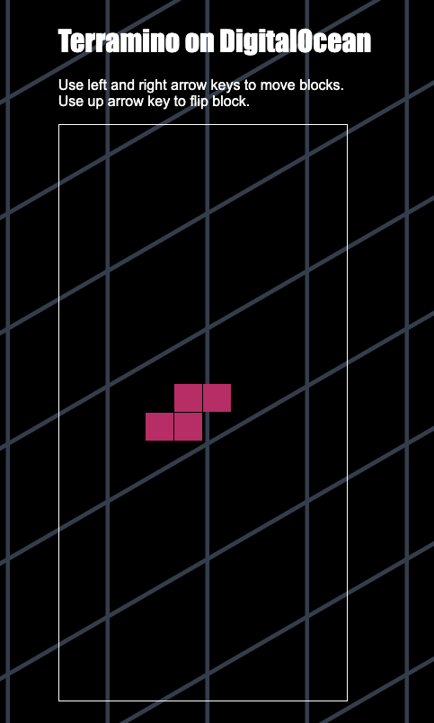

# WORKSHOP 🤖
# CREA UN LABORATORIO DE K8S EN LA NUBE ☁️
# DÍA # 1

## Slides 👨‍🏫
https://docs.google.com/presentation/d/1nMUGhujrUq_67x_i03dTewFhm6-l5UwFHbKtC2Rchw4/edit?usp=sharing    

## Prerequisitos 🤔

### Cuenta de Digital Ocean 🌊
- DigitalOcean es un proveedor de alojamiento en la nube para infraestructura y 
aplicaciones. 
- La plataforma en la nube de DigitalOcean ayuda a los desarrolladores 
a desarrollar, administrar y escalar sus aplicaciones al proporcionar flujos de trabajo 
simples para infraestructuras complejas. 
- DigitalOcean proporciona una máquina virtual 
liviana y económica llamada Droplet 💧 en la que puede implementar aplicaciones y servicios. 

### Terraform 🏗️
- El proveedor de Terraform DigitalOcean le permite implementar y administrar sus Droplets 💧💧
y otra infraestructura como código.

- En este tutorial, usará Terraform para aprovisionar un Digital Ocean Droplet 💧 e implementar 
en él una aplicación de Tetris preconstruida con aspecto de Hashicorp. 

- Configurará el Droplet 💧 con un script de inicio de nube y especificará una clave SSH que pueda 
acceder al Droplet 💧. Luego, utilizará Terraform para escalar la aplicación.

### Docker 🐳
- Que tedioso es instalar cosas en tu maquina, cierto?; correr nuestros comandos dentro de un contenedor 
es mucho mas comodo, Docker en nuestro equipo local correra un contenedor con la version adecuada
de terraform. 

- #### Como iniciar a correr nuestros comandos dentro del contenedor base.
- #### Create SSH Key

    ```bash
    $ ssh-keygen -t ed25519 -C "kind-mesh@digitalocean.com" -q -N '' -f ssh-key
    ```

- #### Inicializar terraform
    ```
    $ docker run -it --rm -v $(pwd):/kind-mesh -w /kind-mesh --entrypoint sh hashicorp/terraform

    /kind-mesh # cd terraform
    /kind-mesh/terraform # ssh-add ssh-key
    ```

    Por si acaso el ultimo comando de agregar la llave falla, te recomendamos ejecutar la siguiente acción
    ```
        eval `ssh-agent -s`
    ```

## Lab 🧪
Guía:
https://learn.hashicorp.com/tutorials/terraform/digitalocean-provider?in=terraform/applications

1. Generar un token de Digital Ocean 🔑
    
    docs: https://docs.digitalocean.com/reference/api/create-personal-access-token/
  
2. Cargar variable de entorno a su equipo local (recuerda estas en un container llamado kind-mesh) 
    ```
        export TF_VAR_digitalocean_token='dop_v1_xxxxxxxxxxxxxxxxx'
    ``` 
3. Pegar la SSH generada en el archivo terramino_app.yaml para habilitar el droplet para conexión.
    ```
        ssh_authorized_keys:
      - # Paste your created SSH key here
    ```
4. Ejectuar `terraform init` prepara el directorio de trabajo para que Terraform pueda ejecutar la configuración.
5. Ejecutar `terraform plan` le permite obtener una vista previa de los cambios antes de aplicarlos.
6. Ejecutar `terraform apply` realiza los cambios definidos por su configuración de Terraform para crear, actualizar o destruir recursos.

7. Conectarse por medio de ssh para revisar la instalación
   ```
   cd ..
   ssh -i ./ssh-key.pub root@ip
   ```
8. Vamos a jugar http://ip
   
   

9.  No olvides destruir tus recursos ⚠️ ejecutando `terraform destroy` o tu dinero se irá volando 💸💸💸💸💸 😂😂

👨‍💻🤘 Bayron Carranza